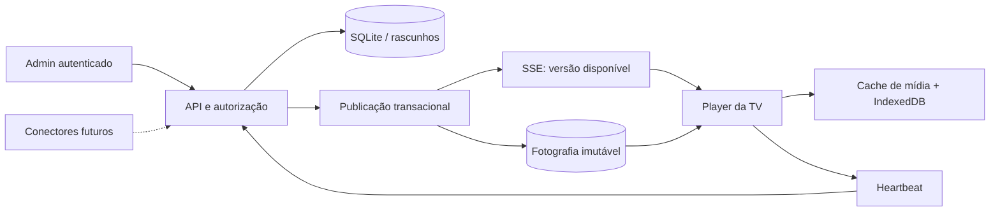

# Arquitetura do GeoTV

## 1. Limites e componentes

O Admin cria conteúdo estruturado. O backend valida, persiste e autoriza. Uma publicação captura conteúdo, ordenação, durações e configurações. O Player consome exclusivamente essa fotografia, nunca os rascunhos.

## 2. Tecnologias e evolução

Node.js 24 executa HTTP, criptografia, streaming e SQLite. O frontend utiliza módulos ES, CSS responsivo e renderização compartilhada. PDF.js é servido localmente para importar PDFs no Admin. PowerPoint é convertido em PDF pelo LibreOffice no servidor, com perfil temporário. Prettier e pdf-lib são dependências exclusivamente de desenvolvimento/teste.

SQLite em WAL atende a uma instalação de servidor único. Banco e mídia ficam em volume persistente. Para expansão, migrar os repositórios e transações para PostgreSQL, mídia para object storage e notificações para um barramento compartilhado. O acesso SQL está no backend, embora a migração ainda exija implementar os novos repositórios; não é uma troca automática de configuração.

Referências técnicas: [SQLite no Node.js 24](https://nodejs.org/download/release/latest-v24.x/docs/api/sqlite.html), [EventSource](https://developer.mozilla.org/en-US/docs/Web/API/EventSource), [Service Worker](https://developer.mozilla.org/en-US/docs/Web/API/Service_Worker_API), [Cache API](https://developer.mozilla.org/en-US/docs/Web/API/Cache).

## 3. Estrutura

- `server/index.js`: HTTP, arquivos estáticos, streaming e headers.
- `server/api.js`: endpoints autenticados e regras de aplicação.
- `server/db.js`: schema, conexão, transação e auditoria.
- `server/security.js`: sessão, hash, autorização, rate limiting e bootstrap.
- `server/validation.js`: contrato de conteúdo.
- `server/publications.js`: snapshots, restauração, destinos e notificações.
- `server/media.js`: armazenamento e validação de uploads.
- `server/connectors.js`: contrato para leituras de fontes futuras.
- `web/admin/app.js`: navegação e interação; `views.js`: telas; `editor.js`: formulário e preview.
- `web/shared/templates.js`: catálogo e renderização comum a Admin/TV.
- `web/shared/schedule.js`: elegibilidade temporal, sem dependência de DOM.
- `web/player/`: sincronização e reprodução sem elementos administrativos.

## 4. Modelo de dados

| Tabela       | Responsabilidade                                                   |
| ------------ | ------------------------------------------------------------------ |
| users        | Nome, e-mail único, senha com salt/hash e perfil                   |
| sessions     | Hash do token, usuário e expiração absoluta                        |
| contents     | Identificador, documento estruturado e data da alteração           |
| playlists    | Nome e itens ordenados com referência de conteúdo/duração          |
| devices      | Nome, grupo, hash da credencial, publicação atribuída e telemetria |
| publications | Versão incremental, snapshot, autor e data                         |
| media        | Nome, categoria, tipo, tamanho, hash único e URL                   |
| emergencies  | Mensagem, janela de exibição e TVs de destino                      |
| audit_logs   | Autor, ação, entidade, antes/depois e instante                     |
| settings     | Preferências de publicação e Player                                |
| data_sources | Reserva de persistência para configuração de conectores            |

Nesta fase, perfis/permissões são um catálogo no código, templates são versionados com a aplicação, grupos são um atributo da TV e itens de playlist são documentos JSON. Isso evita tabelas vazias sem comportamento correspondente. Separar `roles`, `permissions`, `device_groups`, `playlist_items` e `templates` quando houver edição dinâmica, múltiplos grupos por TV ou consultas analíticas que justifiquem a normalização. `publications` já representa as versões imutáveis, dispensando uma segunda tabela com o mesmo conteúdo.

## 5. Admin → publicação → TV

Salvar conteúdo não altera nenhuma publicação. Publicar valida todas as referências, aplica a política de aprovação e cria a versão dentro de uma transação. Os destinos passam a apontar para essa versão na mesma transação. Uma notificação SSE pede aos Players uma nova leitura autenticada. Restaurar seleciona o snapshot histórico e cria outra versão incremental.

Excluir um rascunho remove suas referências nas playlists em edição. Snapshots existentes continuam autocontidos. Remover/arquivar um conteúdo da transmissão exige uma nova publicação, preservando a regra de controle editorial.

## 6. Player

O link de ativação contém a credencial no fragmento da URL. O Player guarda-a localmente e remove o fragmento do endereço visível. A primeira etapa lê IndexedDB e inicia o último snapshot conhecido. Depois registra o Service Worker, sincroniza, carrega mídias e conecta SSE.

A cada segundo reavalia datas, dias da semana, horários e avisos urgentes. A duração de cada item define o avanço; o fim da lista reinicia o ciclo. Avisos interrompem a programação e expiram pelo relógio local. Servidor e TVs precisam de relógios sincronizados.

O stage preserva 16:9 com barras externas quando necessário. Tipografia proporcional ao container mantém a mesma composição no preview, Full HD e 4K. Vídeos são silenciosos por padrão para autoplay. Elementos antigos, vídeos, intervalos e conexões são limpos.

## 7. Atualização em tempo real

SSE utiliza reconexão nativa do EventSource. O evento transporta apenas um sinal; a fonte de verdade é a API de snapshot. Consultas a cada 30 segundos recuperam eventos perdidos. Heartbeat reporta título atual, versão recebida e último sincronismo. Offline significa ausência de heartbeat além de três intervalos, com mínimo de 60 segundos.

SSE nesta versão é local ao processo. Múltiplas instâncias exigem um canal compartilhado. O token é hash no banco, mas o EventSource precisa enviá-lo na query; por isso logs de acesso não devem registrar queries das rotas de Player.

## 8. Cache e offline

O Service Worker armazena os módulos e estilos do Player; IndexedDB armazena a última publicação. A biblioteca Cache Storage recebe os arquivos completos antes da promoção de uma nova versão. Se um download falhar, o Player conserva a versão anterior e tenta novamente. Atualizações de avisos são aplicadas independentemente do download de uma publicação nova.

Vídeos em cache têm atendimento a requisições byte-range. O próximo arquivo já está em cache, e imagens também têm pré-carregamento. O navegador ainda pode levar tempo para decodificar um vídeo: a garantia absoluta de transição sem pausa depende de homologação dos codecs e hardware.

Nesta versão não há limpeza automática de mídias antigas. É preciso dimensionar armazenamento; a evolução inclui orçamento de cache e coleta de arquivos não referenciados. Cache do navegador pode ser removido pelo usuário ou pelo sistema, então offline não substitui backup.

## 9. Segurança

Senhas scrypt com salt individual; tokens aleatórios de 256 bits, armazenados por hash; sessão HttpOnly e SameSite Strict; autorização backend por operação; prepared statements; verificação de origem para mutações; CSP; limite de corpo e rate limiting por IP. O modo produção exige TLS e cookies Secure.

Uploads têm assinatura inicial, MIME, extensão e tamanho conferidos; nomes físicos são UUIDs. Não são executados pelo servidor. As URLs da mídia funcionam como referências não adivinháveis; quem obtiver uma URL pode ler aquele arquivo. Dados que exijam autorização por leitura precisam de um gateway de mídia autenticado adicional.

Não há conectores externos ativos nem iframe arbitrário. Novos conectores devem validar origem, timeouts, esquema de retorno e permissão no backend. Credenciais devem usar referências a segredos do ambiente.

## 10. Fases

O andamento, a cobertura e os critérios de homologação estão em [ROADMAP.md](ROADMAP.md). Esta arquitetura não implica que uma instalação local já esteja homologada para produção.
